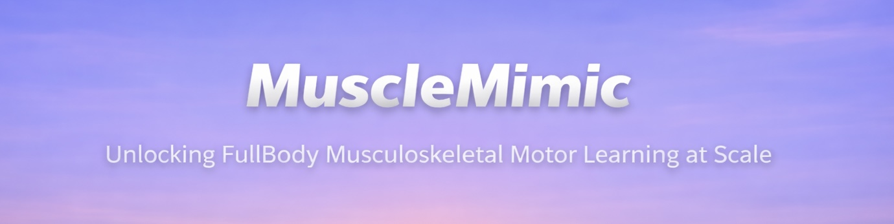
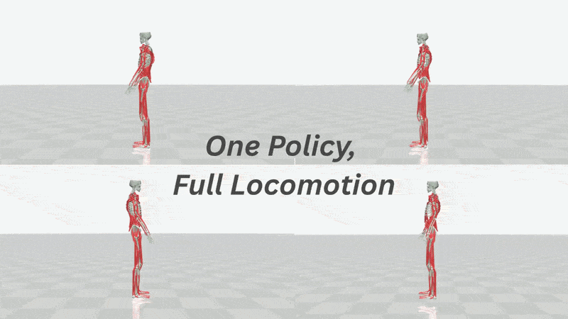
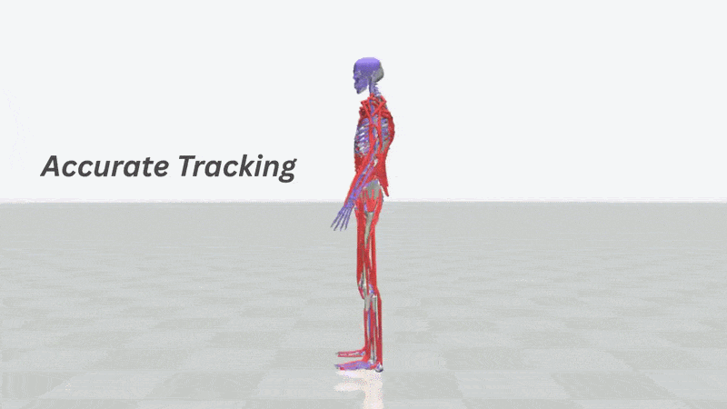

<p align="center">
  
  <a href="LICENSE"></a>
  <a href="https://cnai.epfl.ch/mm-blog/"></a>
  <a href="https://arxiv.org/abs/2603.25544"></a>
</p>

# MuscleMimic: Unlocking full-body musculoskeletal motor learning at scale

**MuscleMimic** is a JAX-based motion imitation learning research benchmark specifically designed for **biomechanically accurate muscle-actuated models**. It focuses on advancing research in muscle-driven locomotion and manipulation through high-performance neural policy training. MuscleMimic addresses the computational challenges of training neural policies on complex biomechanical models by:
- **Muscle-Actuated Dynamics**: Specialized support for physiologically accurate muscle models with Hill-type dynamics
- **JAX/MJWarp Acceleration**: GPU-parallel training with up to 8,192 environments for rapid experimentation with collision support
- **Single Generalist Policy**: A centralized policy trained on diverse datasets to achieve high-dimensional coordination across multiple gait patterns and motions.

## Key Features

- **High-Performance Training**: JAX JIT compilation with MuJoCo Warp backend acceleration  
- **Biomechanical Models**: MyoBimanualArm and MyoFullBody 
- **Research-Ready**: DeepMimic-style rewards with comprehensive validation metrics 
- **AMASS Integration**: Automated retargeting of SMPL format motion dataset. 
- **GMR-FIT Retargeting**: Improved of SOTA inverse kinematics for high quality imitation data.

<div align="center">
  
</div>

## Current Available Models

| Model           | Type        | Joints | Muscles | DoFs | Focus                        |
|-----------------|-------------|--------|---------|---------|------------------------------|
| MyoBimanualArm  | Fixed-base  | 76 (36*)    | 126 (64*)     | 54 (14*) | Upper-body manipulation      |
| MyoFullBody     | Free-root   | 123 (83*)    | 416 (354*)    | 72 (32*) | Locomotion and manipulation    |

##### $^*$ denotes configurations with finger muscles temporarily disabled. 

- **Muscle Actuation**: Hill-type muscle models with physiological activation dynamics
- **Site Tracking**: Biomechanically relevant anatomical landmarks for reward computation

## System Requirements

Depending on how you plan to use `musclemimic`, the requirements differ:

* **Training:** A Linux machine with an NVIDIA GPU is required.
* **Inference & Evaluation:** Both Linux and macOS are fully supported.

## Quick Start

**Preliminaries**

```bash
# 1. Install UV (faster package manager)
curl -LsSf https://astral.sh/uv/install.sh | sh

# 2. Install dependencies
uv sync
```
For CUDA (Linux x86_64), install the CUDA-enabled JAX extra:
```bash
uv sync --extra cuda
```

### Test with Demo Cache
> [!TIP]
> Recommended for first-time users. Start here for the fastest path to a working setup.

No AMASS download needed! We provide pre-retargeted demo motions for both **MyoArmBimanual** and **MyoFullBody** via a gated Hugging Face dataset.

#### 1. Authenticate with Hugging Face

The demo dataset is hosted on Hugging Face and requires access approval:

1. Go to [amathislab/demo_dataset](https://huggingface.co/datasets/amathislab/demo_dataset) and request access.
2. Once approved, create an access token at [huggingface.co/settings/tokens](https://huggingface.co/settings/tokens).
3. Log in from the terminal:
   ```bash
   uv run hf auth login
   ```

#### 2. Download Demo Cache

```bash
uv run python -c "from musclemimic.utils.demo_cache import setup_demo_for_bimanual; setup_demo_for_bimanual()"
uv run python -c "from musclemimic.utils.demo_cache import setup_demo_for_myo_fullbody; setup_demo_for_myo_fullbody()"
```

You can start a short training with either model with:
```bash
uv run bimanual/experiment.py --config-name=conf_bimanual_demo
uv run fullbody/experiment.py --config-name=conf_fullbody_demo
```

### Evaluate a Checkpoint (MuJoCo CPU, e.g. macOS on Apple silicon)

Examples below assume you have already downloaded the demo cache for MyoFullBody:
```bash
uv run python -c "from musclemimic.utils.demo_cache import setup_demo_for_myo_fullbody; setup_demo_for_myo_fullbody()"
```

By default, the provided training configs log to Weights & Biases with `wandb.mode=online`.
If you do not want to use W&B, disable it explicitly:

```bash
uv run bimanual/experiment.py --config-name=conf_bimanual_demo wandb.mode=disabled
uv run fullbody/experiment.py --config-name=conf_fullbody_demo wandb.mode=disabled
```

Run evaluation with the MuJoCo viewer (CPU), using demo motions.
On macOS, use `mjpython` for viewer-based MuJoCo commands. On Linux, a regular `python` entrypoint is sufficient:
```bash
uv run mjpython fullbody/eval.py \
  --path hf://amathislab/mm-10m-2 \
  --motion_path KIT/314/walking_medium09_poses \
  --use_mujoco \
  --stochastic \
  --eval_seed 0 \
  --n_steps 1000 \
  --mujoco_viewer
```

```bash
uv run mjpython fullbody/eval.py \
  --path hf://amathislab/mm-10m-2 \
  --motion_path KIT/348/turn_right03_poses \
  --use_mujoco \
  --stochastic \
  --eval_seed 0 \
  --n_steps 1000 \
  --mujoco_viewer
```

```bash
uv run mjpython fullbody/eval.py \
  --path hf://amathislab/mm-10m-2 \
  --motion_path KIT/4/WalkInCounterClockwiseCircle04_poses \
  --use_mujoco \
  --stochastic \
  --eval_seed 0 \
  --n_steps 1000 \
  --mujoco_viewer
```

## Retargeting with GMR-Fit
Musclemimic offers accurate retargeting to MyoFullBody and MyoBimanualArm based on [General Motion Retargeting (GMR)](https://github.com/YanjieZe/GMR), but incorporates SMPL fitting instead of manually defined joint configurations on AMASS dataset. We offer you the retargeted dataset using GMR-Fit, as well as the pretrained checkpoint upon these motions on huggingface. 

### Hugging Face Resources

- MyoBimanualArm
  - Checkpoints: [amathislab/mm-bimanual-v0](https://huggingface.co/amathislab/mm-bimanual-v0)
  - Dataset: [amathislab/musclemimic-bimanual-retargeted](https://huggingface.co/datasets/amathislab/musclemimic-bimanual-retargeted)

- MyoFullBody
  - Checkpoints: [amathislab/mm-fullbody-base](https://huggingface.co/amathislab/mm-fullbody-base)
  - Dataset: [amathislab/musclemimic-retargeted](https://huggingface.co/datasets/amathislab/musclemimic-retargeted)

<div align="center">
  
</div>


Pre-retargeted GMR caches can be accessed in several ways. If you want to control the local cache location explicitly, set it first:

```bash
uv run musclemimic-set-all-caches --path /path/to/converted_datasets
```

1. Automatic download: set `retargeting_method: gmr` in your config, and the required caches will be downloaded automatically.
2. Manual download from the CLI:

  ```bash
  uv run musclemimic-download-gmr-caches --dataset-group KIT_KINESIS_TRAINING_MOTIONS
  uv run musclemimic-download-gmr-caches --dataset-group AMASS_BIMANUAL_TRAIN_MOTIONS --env-name MyoBimanualArm
  ```

3. Python API:

  ```python
  from musclemimic.utils import download_gmr_dataset_group

  download_gmr_dataset_group("KIT_KINESIS_TRAINING_MOTIONS")
  download_gmr_dataset_group(dataset_group="AMASS_BIMANUAL_TRAIN_MOTIONS", env_name="MyoBimanualArm")
  ```


## Full Retargeting with AMASS

If you prefer to retarget your own dataset in batch. You may follow these steps to download the full dataset from AMASS and set up the retargeting pipeline.

#### 1. Download AMASS
  Register and download the AMASS dataset from [AMASS](https://amass.is.tue.mpg.de/). Place all datasets in a directory (e.g., `/path/to/amass`), such that the folder has the following structure:

  ```
  /path/to/amass/
  ├── ACCAD/
  ├── ...
  ├── KIT/
  │   ├── 1/
  │   │   ├── LeftTurn03_poses.npz
  │   │   └── ...
  │   └── ...
  ├── ...
  ```

Install SMPL dependencies (torch, smplx, gmr_plus)
```bash
uv sync --extra smpl --extra gmr
```

#### 2. Download SMPL-H and MANO
  Go to the [MANO website](https://mano.is.tue.mpg.de/download.php). Register and download the following:
   - **Extended SMPL+H model** (includes the SMPL-H model w/o hands).
   - **Models & Code** (includes the hand models).
  
  Extract the folders and place them in a directory (e.g., `/path/to/smpl`), such that the folder has the following structure:
  ```
  /path/to/smpl/
  ├── mano_v1_2/
  └── smplh/
  ```

#### 3. Set Paths
Set the paths to the AMASS dataset, SMPL models, and specify a directory for the converted caches:

```bash
uv run musclemimic-set-amass-path --path /path/to/amass
uv run musclemimic-set-smpl-model-path --path /path/to/smpl
uv run musclemimic-set-all-caches --path /path/to/converted_datasets
```

These commands write user-specific settings to `~/.musclemimic/MUSCLEMIMIC_VARIABLES.yaml` by default.
Set `MUSCLEMIMIC_CONFIG_PATH` if you want to use a different config file.

#### 4. Convert SMPL-H and MANO to SMPLH_neutral.pkl
Run the conversion script to generate the `SMPLH_neutral.pkl` file needed for retargeting:

```bash
cd loco_mujoco/smpl
bash install_smplh.sh
```

#### 5. Run the retargeting pipeline with your preferred dataset. We report the accuracy of retargeting with GMR on several dataset in our [preprint](https://arxiv.org/abs/2603.25544). 

```bash
uv run scripts/retarget_dataset.py --model MyoFullBody --retargeting-method gmr --dataset KIT_KINESIS_TRAINING_MOTIONS --workers 8
uv run scripts/retarget_dataset.py --model MyoBimanualArm --retargeting-method gmr --dataset AMASS_BIMANUAL_MARGINAL_MOTIONS --workers 8
```

## Training and Finetuning from a Checkpoint

The following examples show how to resume from a pretrained checkpoint for either targeted finetuning or broader continued training.

### Finetune on a Specific Motion

For targeted finetuning, we reset the policy standard deviation to 3 to encourage exploration on the new motion.

```bash
uv run fullbody/experiment.py --config-name=conf_fullbody_gmr_resnet \
  experiment.resume_from="hf://amathislab/mm-fullbody-base" \
  experiment.reset_std_on_resume=3 \
  experiment.task_factory.params.amass_dataset_conf.dataset_group=null \
  experiment.task_factory.params.amass_dataset_conf.rel_dataset_path='["KIT/200/Handstand01_poses"]'
```

### Continue Training on a Larger Motion Set

To continue training on a broader motion distribution, resume from the same checkpoint and switch to the transition-augmented training set.

```bash
uv run fullbody/experiment.py --config-name=conf_fullbody_gmr_resnet \
  experiment.resume_from="hf://amathislab/mm-fullbody-base" \
  experiment.task_factory.params.amass_dataset_conf.dataset_group="KIT_KINESIS_TRANSITION_TRAINING_MOTIONS"
```

## Visualization with Viser

You could use [Viser](https://github.com/nerfstudio-project/viser) for real-time policy visualization with muscle tendons.

Example:

```bash
# MyoBimanualArm visualization
uv run bimanual/eval.py \
  --path outputs/YYYY-MM-DD/HH-MM-SS/checkpoints/XXXXXX/checkpoint_XXX \
  --use_mujoco --viser_viewer

# MyoFullBody visualization
uv run fullbody/eval.py \
  --path outputs/2025-10-12/09-32-55/checkpoints/2510120733/checkpoint_400 \
  --use_mujoco --viser_viewer
```

### Usage Notes

- Requires `--use_mujoco` flag (Viser only works with CPU MuJoCo, not MJX)

---

## Development

For contributor setup and review guidelines, see [CONTRIBUTING.md](CONTRIBUTING.md).

Typical local workflow:

```bash
make install-dev
make precommit-install
make ci
```

`pre-commit` currently targets a curated subset of files while the repository is being migrated toward broader coverage. `make lint` and `make format` intentionally follow that same scoped set rather than reformatting the whole repository. Please keep changes to `.pre-commit-config.yaml`'s `files:` allowlist in dedicated cleanup PRs rather than bundling them with functional changes.


## Citation

If you use this code in your research, please cite:

```bibtex
@article{Li2026MuscleMimic,
  title={Towards Embodied AI with MuscleMimic: Unlocking full-body musculoskeletal motor learning at scale},
  author={Li, Chengkun and Wang, Cheryl and Ziliotto, Bianca and Simos, Merkourios and Kovecses, Jozsef and Durandau, Guillaume and Mathis, Alexander},
  journal={arXiv preprint arXiv:2603.25544},
  year={2026}
}
```

## License
This project is licensed under the [Apache License](LICENSE).
See the [LICENSE](LICENSE) file for details.

Note that model checkpoints and data are licensed separately as indicated on the HuggingFace download pages. 

This project will also require downloading additional third-party open-source software projects, please review each license terms accordingly before use. 

## Acknowledgments

Inspired by and built on:
- [MyoSuite](https://github.com/MyoHub/myosuite)
- [Mujoco_warp](https://github.com/google-deepmind/mujoco_warp)
- [Kinesis[(https://github.com/amathislab/Kinesis)
- [LocoMuJoCo](https://github.com/robfiras/loco-mujoco)
- [SMPL-X](https://github.com/vchoutas/smplx) - Body model for motion retargeting
- [PureJaxRL](https://github.com/luchris429/purejaxrl)
- [MuJoCo Playground](https://github.com/google-deepmind/mujoco)
