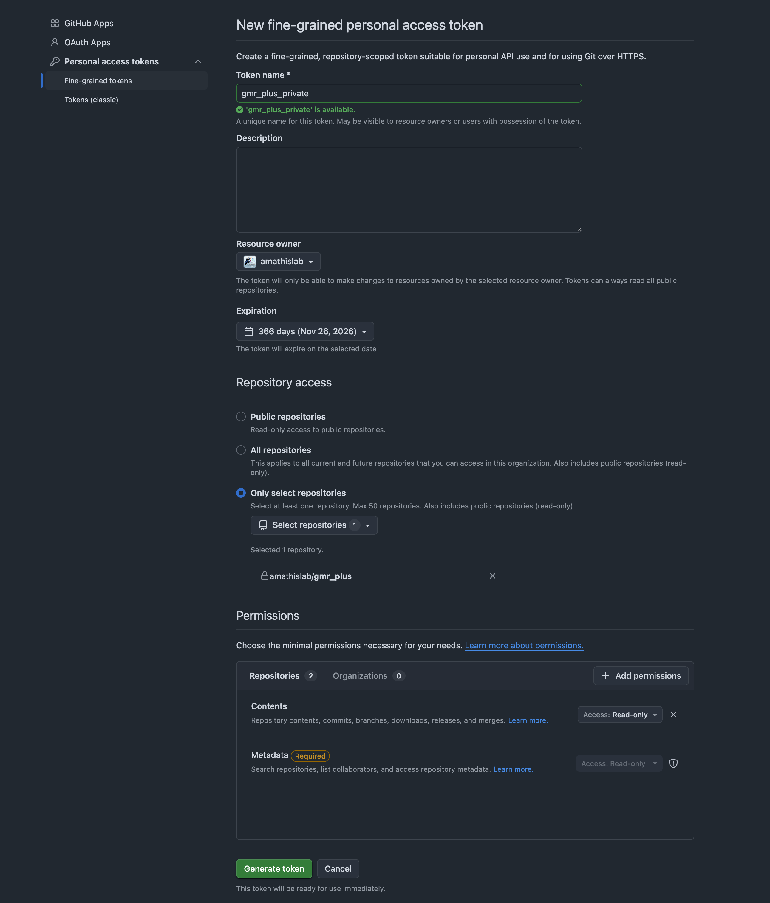

# Setup access token to use private repository gmr_plus

Go to github and create a new finegrained personal access token with repo access. Go to settings -> Developer settings -> Personal access tokens -> Fine-grained tokens -> Generate new token.


```bash
echo "machine github.com login x-access-token password <generated_token>" > /mnt/upamathis/scratch/<username>/.netrc
chmod 600 /mnt/upamathis/scratch/<username>/.netrc
```

# Submitting Jobs with Run:AI
An example of submitting with Run:AI

```bash
runai submit \
  --name mm-$(date +%m%d-%H%M%S) \
  --image registry.rcp.epfl.ch/musclemimic/uv-musclemimic:latest \
  --run-as-uid <your_epfl_uid> \
  --run-as-gid <your_epfl_gid> \
  --gpu 1 --node-pools h100 \
  --existing-pvc claimname=<your_claim_name>,path=/users \
  --environment UV_PROJECT_ENVIRONMENT=/tmp/venv \
  --environment UV_CACHE_DIR=/users/<your_username>/.cache/uv \
  --environment UV_PYTHON_INSTALL_DIR=/users/<your_username>/.uv-pythons \
  --environment HOME=/users/<your_username> \
  --environment WANDB_API_KEY=<your_wandb_key> \
  --environment WANDB_ENTITY=<your_wandb_entity> \
  --backoff-limit 0 \
  --command -- /bin/bash -c "cd /users/<your_username>/musclemimic_dev; uv sync --extra smpl --extra gmr --extra cuda; uv run fullbody/experiment.py --config-name=<some_config>"
```
